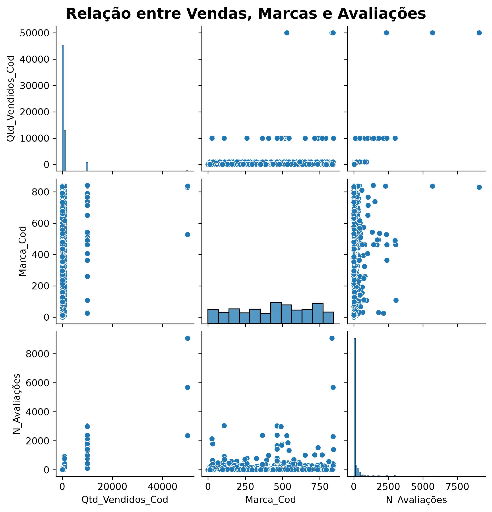
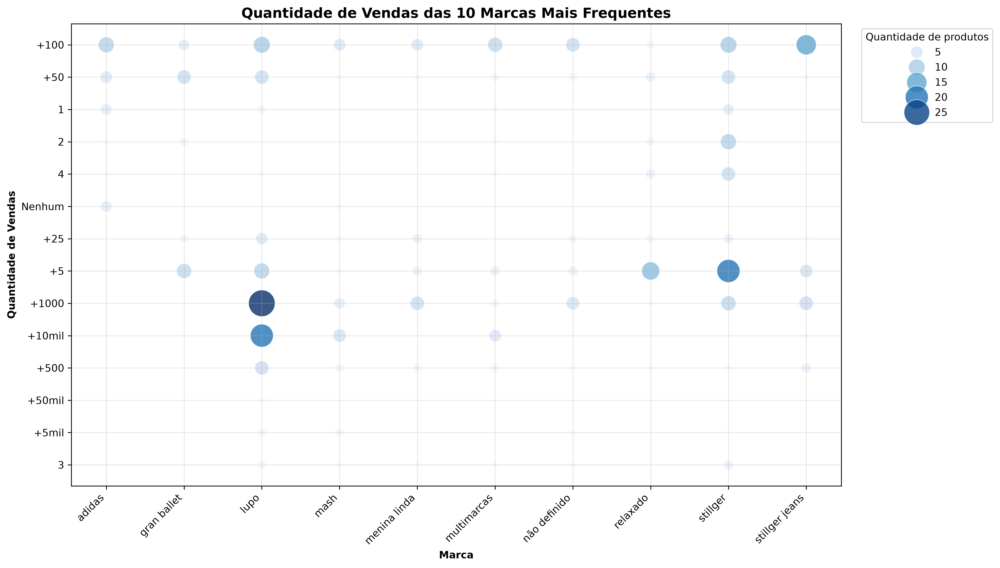
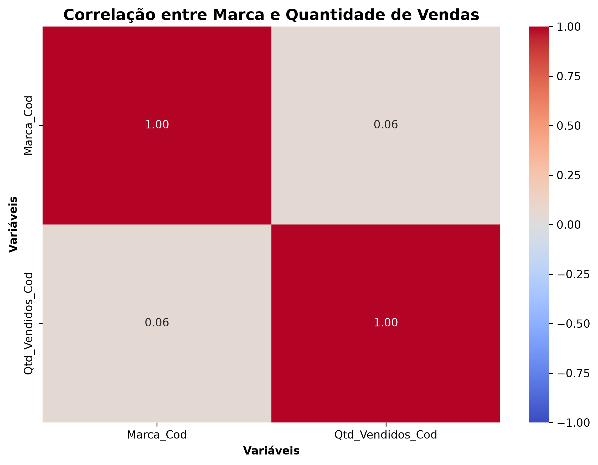
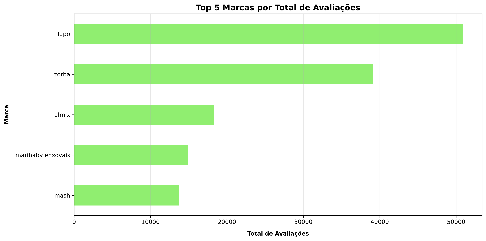
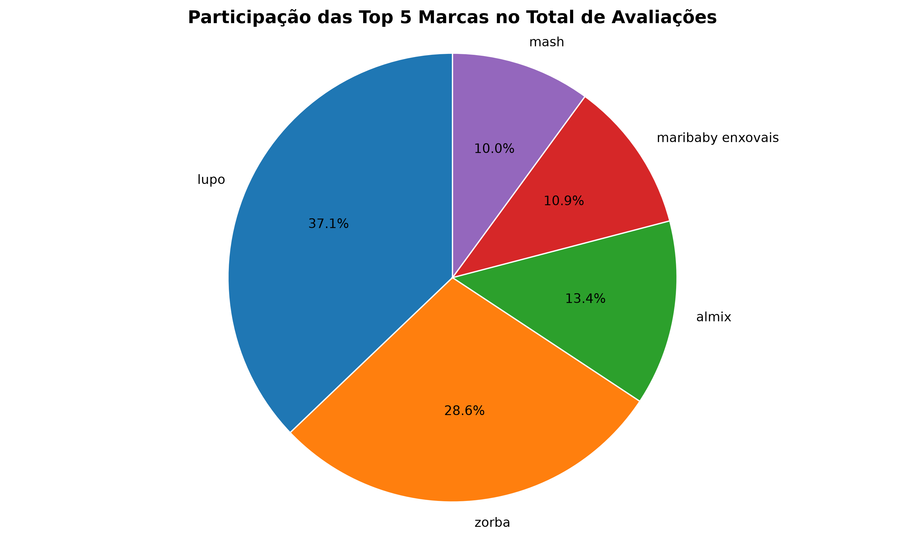
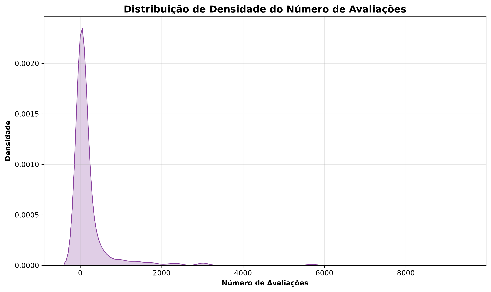
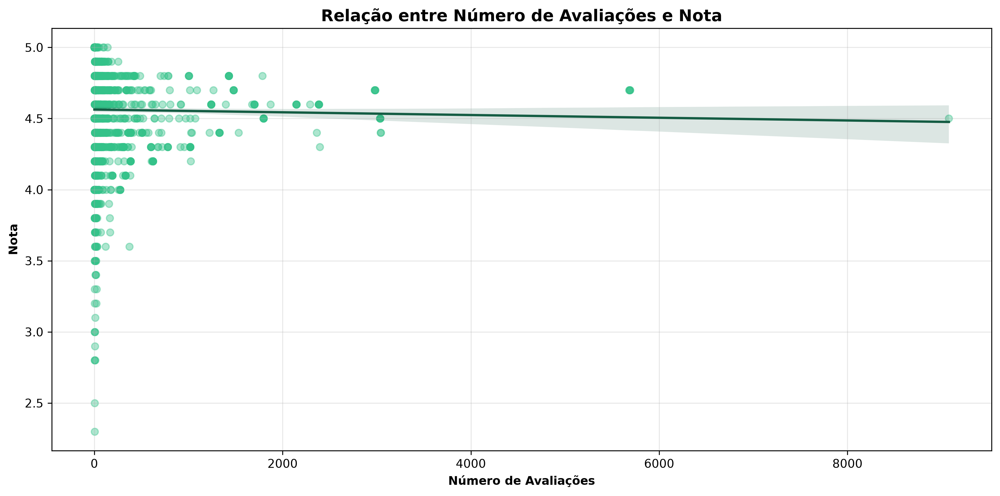

# Visualização de Dados de E-commerce

Projeto desenvolvido durante o Módulo 10 do curso Profissão Cientista de Dados da EBAC, com foco na criação e interpretação de visualizações utilizando dados de produtos de e-commerce.

## Objetivo

Explorar visualmente as relações entre marcas, quantidade de vendas, número de avaliações e notas dos produtos, facilitando a identificação de padrões e tendências presentes nos dados.

## Tecnologias utilizadas

- Python
- Pandas
- Matplotlib
- Seaborn
- Jupyter Notebook
- Visual Studio Code

## Base de dados

O projeto utiliza o arquivo `ecommerce_preparados.csv`, contendo informações tratadas sobre produtos, marcas, vendas, avaliações e notas.

## Análises realizadas

- Relação entre vendas, marcas e avaliações por meio de pairplot.
- Distribuição das vendas entre as marcas mais frequentes.
- Correlação entre marca e quantidade de vendas.
- Identificação das cinco marcas com maior total de avaliações.
- Participação percentual das principais marcas nas avaliações.
- Distribuição de densidade do número de avaliações.
- Relação entre número de avaliações e nota dos produtos.

## Visualizações

### Relação entre vendas, marcas e avaliações



### Top 10 marcas por quantidade de vendas



### Correlação entre marca e quantidade de vendas



### Top 5 marcas por total de avaliações



### Participação das principais marcas nas avaliações



### Densidade do número de avaliações



### Relação entre número de avaliações e nota



## Estrutura do projeto

```text
ebac-modulo-10-visualizacao-dados/
├── Imagem/
│   ├── correlacao_marca_quantidade_vendas.png
│   ├── densidade_numero_avaliacoes.png
│   ├── pairplot_vendas_marcas_avaliacoes.png
│   ├── participacao_top_5_marcas_avaliacoes.png
│   ├── regressao_avaliacoes_nota.png
│   ├── top_5_marcas_total_avaliacoes.png
│   └── top_10_marcas_quantidade_vendas.png
├── .gitignore
├── ecommerce_preparados.csv
├── visualizacao_dados_ecommerce.ipynb
└── README.md
```

## Como executar

1. Clone este repositório.
2. Instale as bibliotecas necessárias:

```bash
pip install pandas matplotlib seaborn jupyter
```

3. Abra e execute o notebook `visualizacao_dados_ecommerce.ipynb`.

## Autor

Leandro Gomes

[GitHub](https://github.com/leandroanalytics)
